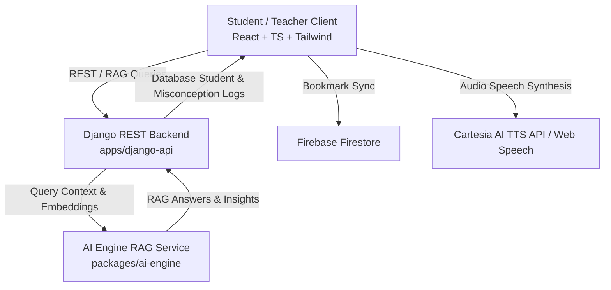

# Argonyx Educational Platform — Comprehensive Feature & System Architecture Outline

## 1. Executive Overview

**Argonyx** is an adaptive, accessible, AI-powered learning and mentorship platform engineered for diverse cognitive needs (including **Dyslexia** and **ADHD**). It bridges real-time classroom insights, personalized diagnostics, AI-guided misconception logs, global educational resource discovery, and teacher mentorship analytics into a unified web application.

---

## 2. Core Platform Capabilities & Feature Matrix

### 2.1 Neurodiverse Accessibility & Adaptive Design System
- **Dyslexia Assistive Mode**:
  - **OpenDyslexic Typography**: Automatically enforces weighted bottom glyphs across text elements (`line-height: 1.85`, `letter-spacing: 0.05em`, `word-spacing: 0.15em`) to prevent letter rotation and visual drift.
  - **68px Interactive Reading Scale (`ReadingRuler.tsx`)**: Smooth cursor-following highlight aperture band (68px window height, `rgba(254, 240, 138, 0.25)` contrast tint with amber border framing) providing distraction-free line tracking across lengthy text passages.
  - **Auditory Text-to-Speech (TTS)**: Integration with Cartesia AI (`sonic-2` model) and native Web Speech API fallback for hands-free audio playback of questions, option descriptions, and micro-lessons at a comfortable rate (`0.9x`).
- **ADHD Focus Mode**:
  - **Low-Distraction Warm Palette**: Calming `#FAF8F5` canvas with reduced visual noise and auto-collapsed secondary sidebars.
  - **Bite-Sized Card Interfaces**: Micro-lesson chunks that prevent cognitive overload and encourage incremental task completion.
- **Dynamic Theme & Mode Switcher**:
  - Instant toggle between **Standard Editorial**, **ADHD Focus**, and **Dyslexia Mode** stored in local storage and synced with DOM body classes (`mode-adhd`, `mode-dyslexic`).

---

### 2.2 LearnLens Cognitive Diagnostic Engine
- **Multi-Stage Diagnostic Pipeline**:
  - **Stage 0 (Diagnostic Challenge)**: Interactive equation/concept solving with audio assist buttons on options.
  - **Stage 1 (Cognitive Pattern Diagnosis)**: Categorizes student answers into specific misconception types (e.g., *Sign Inversion Error*, *Operator Precedence Swap*, *Formula Misapplication*).
  - **Stage 2 (60-Second Micro-Lesson)**: Targeted remedial explanation using real-world analogies (e.g., *Debt Cancellation Rule for negative multiplication*).
  - **Stage 3 (Transfer Verification)**: Single-question quick check to verify concept retention.
  - **Stage 4 (Mastery Report)**: Live mastery percentage updates (e.g., *88% Concept Mastery*) persisted to the student profile.
- **Dedicated Accessibility Views**:
  - `DyslexicDiagnosticView.tsx`: Extra-spaced, audio-first layout with high-contrast buttons and readable fonts.
  - `ADHDDiagnosticView.tsx`: Focused step-by-step progress cards without distracting background elements.

---

### 2.3 Teacher Intelligence & Mentorship Analytics (`#teacher-students`)
- **Unified Cohort & Student Management**:
  - Displays real-time database students alongside cohort statistics.
  - Custom rounded dropdowns for cohort filter selection with smooth transitions and elevation styling.
- **Individual Student Misconception Log**:
  - Teachers can view a detailed breakdown of misconceptions per student.
  - Tracks specific error categories, resolution statuses (Resolved, In Progress, Critical), timestamps, and confidence impact scores.
- **Multi-Parameter Student Comparison Matrix**:
  - Cross-student analysis comparing real database students on performance score, active misconception count, mastery velocity, and diagnostic time.
- **AI Mentorship RAG Assistant (`TeacherInsightsChat.tsx`)**:
  - **Retrieval-Augmented Generation (RAG)**: Answers teacher queries using context fetched directly from student records, misconception logs, and diagnostic history.
  - **Suggested Quick Prompts**: One-click action prompts (e.g., *"Which students are struggling with negative sign rules?"*, *"Generate revision plan for Aarav Sharma"*).

---

### 2.4 Educational Resource Library & Global OER Engine
- **Curated Resource Discovery**:
  - Browse interactive simulations, video explainers, practice problem sets, and PDF cheat sheets across subjects (Mathematics, Computer Science, Physics, Chemistry).
- **Expanded Open Educational Resource (OER) Generator**:
  - Dynamic fallback system in `dataService.ts` and `packages/ai-engine/ai_engine/generators.py` that generates structured learning materials when local DB queries yield limited results.
- **Personalized Course Bookmarks**:
  - Real-time Firestore sync and local caching for saving/unsaving course resources, complete with floating top-level toast feedback (`AppShell.tsx`).

---

### 2.5 AI Test Misconception Insights (`AiTestInsights.tsx`)
- **Expanded Item Card Width (+2mm)**:
  - Spacious card layouts featuring misconception severity badges, error frequency charts, and step-by-step remediation suggestions.
- **Expanded Profile Menu & Navigation**:
  - Header profile menu card (`AppShell.tsx`) expanded to `w-80` with high z-index layering (`z-[9999]`) preventing header overlap conflicts.

---

## 3. Technology Stack & System Architecture

| Layer | Technologies & Dependencies |
| :--- | :--- |
| **Frontend** | React 18, TypeScript, Tailwind CSS, Lucide Icons, Vite |
| **Backend API** | Python 3.11, Django, Django REST Framework, Gunicorn |
| **AI / RAG Engine** | Python, LangChain / Custom RAG Pipeline, Cartesia TTS |
| **Database & Auth** | Firebase Auth, Firestore, PostgreSQL / SQLite (Django ORM) |
| **Styling & Fonts** | Custom CSS Variables, OpenDyslexic, Fraunces, Inter |

---

## 4. Key File & Directory Mapping

| Directory / File | Description & Purpose |
| :--- | :--- |
| `apps/student-fe/src/components/ReadingRuler.tsx` | 68px Dyslexic reading scale tracking ruler component |
| `apps/student-fe/src/context/ThemeModeContext.tsx` | Global theme mode state (`normal`, `adhd`, `dyslexic`), TTS audio engine, toast manager |
| `apps/student-fe/src/pages/TeacherInsightsView.tsx` | Teacher analytics dashboard, cohort dropdown, student comparison matrix |
| `apps/student-fe/src/components/TeacherInsightsChat.tsx` | AI RAG chatbot interface for teacher mentorship queries |
| `apps/student-fe/src/pages/LearnLensDiagnostic.tsx` | Student diagnostic launcher and stage controller |
| `apps/student-fe/src/pages/DyslexicDiagnosticView.tsx` | Dyslexia-optimized diagnostic interface with audio prompts |
| `apps/student-fe/src/pages/EducationalResourceLibrary.tsx` | Resource catalog with search, subject filters, and bookmarking |
| `apps/student-fe/src/services/dataService.ts` | Frontend API client for Django backend and Firestore |
| `apps/django-api/api/views/teacher_insights.py` | Django endpoints for student misconception logs & DB student fetching |
| `apps/django-api/api/views/rag.py` | Django RAG endpoint delivering contextual AI answers to teachers |
| `packages/ai-engine/ai_engine/generators.py` | Python AI content generators and RAG context formatters |

---

## 5. Verification & Quality Assurance
- **TypeScript Integrity**: `npx tsc --noEmit` verified clean with **0 errors**.
- **Z-Index Layering**: Toast notifications (`z-[10000]`), Profile Card Menu (`z-[9999]`), Header Navbar (`z-[500]`), Reading Ruler overlay (`z-[35]`).
- **Responsive Layout**: Designed for seamless viewing across mobile, tablet, and desktop viewports.
