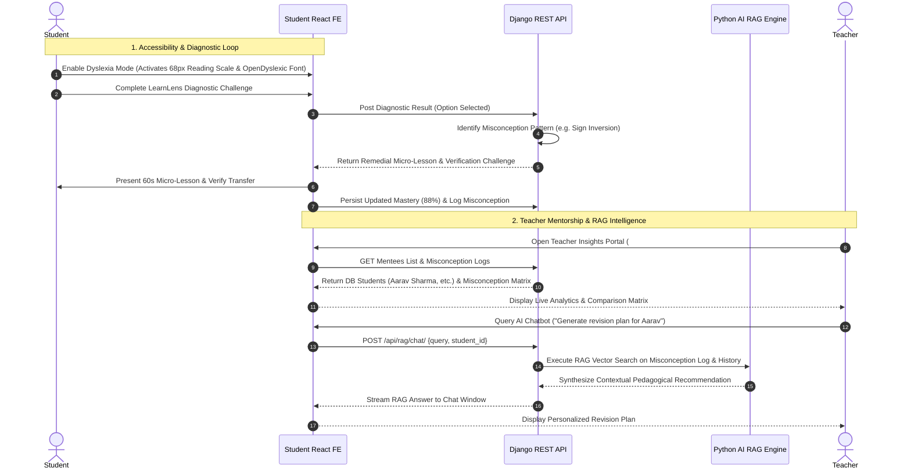
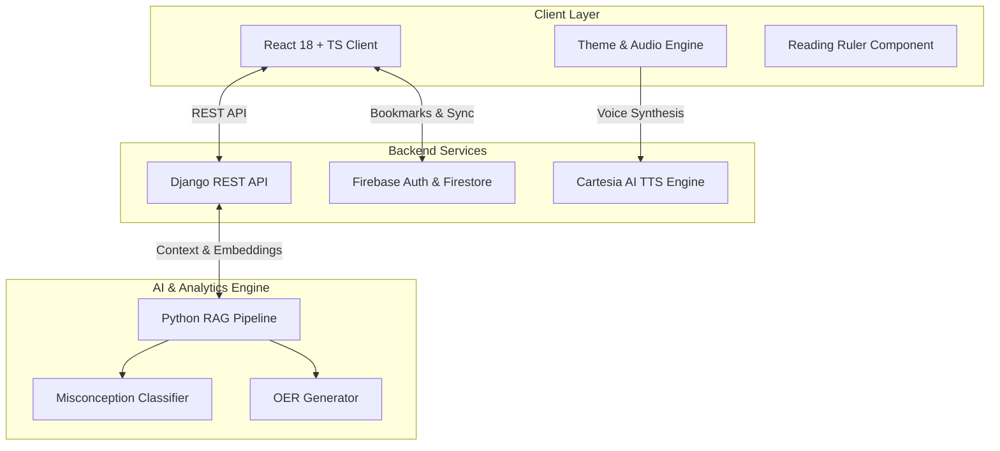

# Argonyx — Adaptive AI-Powered Learning & Mentorship Platform

> **Empowering Neurodiverse Learners & Transforming Teacher Mentorship through Adaptive AI Diagnostics, RAG Intelligence, and Cognitive Accessibility.**

---

## 📋 Table of Contents
1. [Executive Summary & Problem Statement](#-1-executive-summary--problem-statement)
2. [The Argonyx Solution](#-2-the-argonyx-solution)
3. [Core Feature Breakdown](#-3-core-feature-breakdown)
4. [Complete Project Workflow & Feature Interaction](#-4-complete-project-workflow--feature-interaction)
5. [System Architecture & Technology Stack](#-5-system-architecture--technology-stack)
6. [Directory & File Organization](#-6-directory--file-organization)
7. [Getting Started & Installation Guide](#-7-getting-started--installation-guide)
8. [Conclusion & Future Roadmap](#-8-conclusion--future-roadmap)

---

## 🎯 1. Executive Summary & Problem Statement

### The Problem
Traditional educational software is designed around a one-size-fits-all model that fails to accommodate the cognitive and perceptual needs of **neurodiverse students**:
* **Dyslexic Learners**: Experience visual overcrowding, letter rotation/inversion, line-skipping, and rapid visual fatigue when reading dense standard fonts.
* **ADHD Learners**: Suffer from cognitive overload, attention fragmentation, and disengagement when confronted with complex, non-chunked user interfaces.
* **Teachers & Mentors**: Lack real-time, actionable visibility into **why** a student is failing a concept. Traditional test scores highlight *errors*, but fail to identify underlying **cognitive misconception patterns** (e.g., *Sign Inversion Error* vs. *Order of Operations Swap*).

### The Vision
**Argonyx** resolves this gap by combining **neurodiverse accessibility design**, **adaptive diagnostic micro-lessons**, and an **AI-driven Retrieval-Augmented Generation (RAG) Teacher Portal**.

---

## 💡 2. The Argonyx Solution

Argonyx provides a dual-interface ecosystem tailored for both students and educators:

| Pillar | Solution Capabilities |
| :--- | :--- |
| **Cognitive Accessibility** | Dynamic mode engine supporting **OpenDyslexic weighted typography**, a cursor-following **68px Interactive Reading Scale**, **Cartesia Sonic-2 Text-to-Speech (TTS)**, and an **ADHD Focus Mode** with warm, low-distraction cards. |
| **Diagnostic Micro-Lessons** | **LearnLens Diagnostic Engine** that breaks down complex math and science problems into 5 adaptive stages, mapping student responses directly to misconception logs and updating real-time mastery scores. |
| **Teacher Intelligence** | **Mentorship Dashboard (`#teacher-students`)** featuring real database student analytics, a multi-parameter student comparison matrix, individual student misconception logs, and an AI RAG Chatbot. |
| **Global Resource Discovery** | **Educational Resource Library** offering curated OER (Open Educational Resources) with AI-powered fallback generation and real-time Firestore sync bookmarking. |

---

## ✨ 3. Core Feature Breakdown

### 3.1 Neurodiverse Accessibility Engine
* **Dyslexia Assistive Mode**:
  * **OpenDyslexic Font Injection**: Automatically applies heavy-bottomed letterforms across headings, paragraphs, and inputs (`line-height: 1.85`, `letter-spacing: 0.05em`) to anchor glyphs visually.
  * **68px Interactive Reading Scale (`ReadingRuler.tsx`)**: A smooth 68px transparent aperture band (`rgba(254, 240, 138, 0.25)`) that moves dynamically with the mouse cursor to keep readers focused on a single line.
  * **Cartesia AI TTS Synthesis**: High-clarity voice output (`sonic-2` model) with native Web Speech API fallback for reading questions, options, and micro-lessons aloud at an optimal pace (`0.9x`).
* **ADHD Focus Mode**:
  * **Warm Visual Palette**: Soft canvas backdrop (`#FAF8F5`) with auto-collapsed sidebars to eliminate visual clutter.
  * **Bite-Sized Modular Cards**: Micro-chunked information presentation preventing cognitive strain.

---

### 3.2 LearnLens Cognitive Diagnostic Engine
A 5-stage diagnostic pipeline that transforms error detection into immediate remediation:
1. **Stage 0 (Diagnostic Challenge)**: Interactive problem solving with option-level audio buttons.
2. **Stage 1 (Cognitive Pattern Diagnosis)**: Identifies the root misconception pattern (e.g., *Sign Inversion Error*).
3. **Stage 2 (60-Second Micro-Lesson)**: Delivers intuitive remedial analogies (e.g., *Debt Cancellation Rule for negative multiplication*).
4. **Stage 3 (Transfer Verification)**: Single-question verification challenge to confirm understanding.
5. **Stage 4 (Mastery Report)**: Persists real-time mastery metrics (e.g., *88% Concept Mastery*) to the student profile.

---

### 3.3 Teacher Intelligence & Mentorship Portal (`#teacher-students`)
* **Live Student Analytics**: Connects directly to backend database student records to display live mastery percentages, active misconceptions, and recent test activity.
* **Student Misconception Log**: Gives teachers granular insight into each mentee's specific misconceptions, severity levels, resolution statuses, and timestamps.
* **Multi-Parameter Student Comparison Matrix**: Compares students side-by-side on performance score, active misconception count, mastery velocity, and diagnostic completion time.
* **Cohort Selector**: Modern rounded dropdown UI with smooth transitions for filtering cohorts.

---

### 3.4 AI Mentorship RAG Assistant (`TeacherInsightsChat.tsx`)
* **Retrieval-Augmented Generation (RAG)**: Processes student diagnostic histories, active misconception logs, and performance metrics through a Python AI vector RAG pipeline.
* **Actionable Teacher Prompts**: Teachers can click one-touch prompts or type custom queries (e.g., *"Which of my mentees need extra help with negative signs?"*, *"Draft a study plan for Aarav Sharma"*).

---

### 3.5 Educational Resource Library & Bookmarking Engine
* **Subject-Wise Resource Discovery**: Filter interactive simulations, video explainers, practice sets, and cheat sheets across Math, CS, Physics, and Chemistry.
* **AI OER Fallback Generator**: When local query results are scarce, the backend generates structured educational resources automatically.
* **Firestore Bookmark Sync**: Save resources with real-time Firestore persistence and top-level toast notifications.

---

## 🔄 4. Complete Project Workflow & Feature Interaction

The following sequence details how data and user interactions flow seamlessly across the entire platform:



---

## 🏗️ 5. System Architecture & Technology Stack



### Technology Stack Summary

| Domain | Technology / Framework |
| :--- | :--- |
| **Frontend Framework** | React 18, TypeScript, Vite |
| **Styling & UI** | Tailwind CSS, Lucide Icons, Custom CSS Variables |
| **Typography** | OpenDyslexic, Fraunces, Inter |
| **Backend API** | Python 3.11, Django 4.x, Django REST Framework |
| **AI / RAG Pipeline** | Python, LangChain / Vector Store Integration |
| **Audio & TTS** | Cartesia AI (`sonic-2` model), Web Speech API |
| **Database & Auth** | Firebase Authentication, Firestore, SQLite / PostgreSQL |

---

## 📁 6. Directory & File Organization

```
argonyx2/
├── apps/
│   ├── student-fe/                      # React + TypeScript Frontend
│   │   ├── src/
│   │   │   ├── components/              # Global UI Components
│   │   │   │   ├── ReadingRuler.tsx     # 68px Dyslexic Reading Scale
│   │   │   │   ├── Navbar.tsx           # Navigation Header
│   │   │   │   └── AppShell.tsx         # Layout & Profile Dropdown
│   │   │   ├── context/
│   │   │   │   └── ThemeModeContext.tsx # Mode Switcher & TTS Engine
│   │   │   ├── pages/
│   │   │   │   ├── TeacherInsightsView.tsx # Teacher Analytics & Matrix
│   │   │   │   ├── LearnLensDiagnostic.tsx  # Diagnostic Launcher
│   │   │   │   ├── DyslexicDiagnosticView.tsx # Dyslexia Diagnostic Layout
│   │   │   │   ├── ADHDDiagnosticView.tsx     # ADHD Diagnostic Layout
│   │   │   │   └── EducationalResourceLibrary.tsx # OER Library
│   │   │   └── services/
│   │   │       ├── dataService.ts       # Django API & Firestore Client
│   │   │       └── teacherInsightsService.ts # Teacher Portal API Calls
│   │   └── package.json
│   │
│   └── django-api/                      # Django Backend REST API
│       ├── api/
│       │   ├── views/
│       │   │   ├── teacher_insights.py  # Mentee & Misconception Endpoints
│       │   │   ├── rag.py               # RAG Chatbot API
│       │   │   └── mentees.py           # Student Profiles API
│       │   └── urls.py                  # API Route Definitions
│       └── manage.py
│
└── packages/
    └── ai-engine/                       # Python AI & RAG Engine
        └── ai_engine/
            └── generators.py            # RAG Prompt Formatters & Generators
```

---

## 🚀 7. Getting Started & Installation Guide

### Prerequisites
* **Node.js**: v18.0.0 or higher
* **Python**: v3.11 or higher
* **npm** or **yarn**

### 1. Clone & Setup Workspace
```bash
git clone https://github.com/your-org/argonyx.git
cd argonyx
```

### 2. Configure Environment Variables
Create a `.env` file inside `apps/student-fe/`:
```env
VITE_CARTESIA_API_KEY=your_cartesia_key_here
VITE_FIREBASE_API_KEY=your_firebase_key_here
VITE_DJANGO_API_URL=http://127.0.0.1:8000
```

### 3. Start Backend API
```bash
cd apps/django-api
python -m venv venv
# On Windows:
.\venv\Scripts\activate
# On macOS/Linux:
source venv/bin/activate

pip install -r requirements.txt
python manage.py migrate
python manage.py runserver 127.0.0.1:8000
```

### 4. Start Frontend Client
```bash
cd apps/student-fe
npm install
npm run dev
```
Open `http://localhost:3000` in your browser.

---

## 🏆 8. Conclusion & Future Roadmap

**Argonyx** sets a new standard for inclusive educational technologies by marrying cognitive accessibility with intelligent AI mentorship. By addressing visual and cognitive barriers for learners while providing teachers with transparent, RAG-guided misconception analytics, Argonyx turns raw diagnostic data into meaningful learning breakthroughs.

### Future Expansion:
- [ ] Multilingual speech synthesis for global OER content.
- [ ] Automated real-time classroom misconception heatmaps.
- [ ] Mobile-native gesture-based reading ruler controls.
